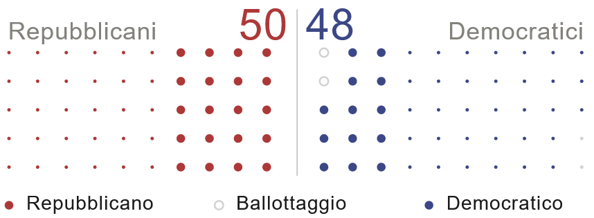
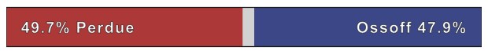
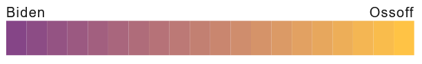
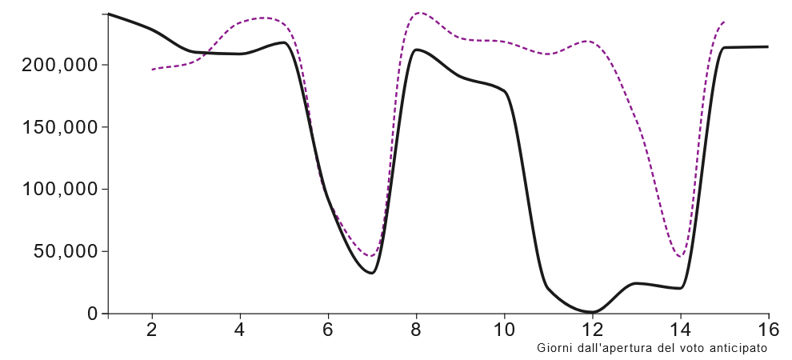

# GA2020_ScrollytellingArticle_YouTrend

 ## Table of contents
 * [General info](#general-info)
 * [Built with](#built-with)
 * [Project files](#project-files)
 * [Prerequisites](#prerequisites)
 * [Acknowledgments](#acknowledgments)
 * [d3 Visualizations](#d3-visualizations)
 * [License](#license)

 ## General info
 This is a scrollytelling article created for [YouTrend](https://www.youtrend.it "YouTrend's Homepage"). The content presents what people need to know before the 2021 Senate Goergia runoffs. The article is entirely created with html and javascript. The data displayed on the maps and charts has been either downloaded  manually or scratched with python, it has then been cleant with python and uploaded in a csv file on github, to be finally connected with the webpage.The article was published at [this link](https://www.youtrend.it/2021/01/04/usa-2020-dalla-georgia-passa-il-controllo-del-senato/ "USA 2020: dalla Georgia passa il controllo del Senato").

 ## Built with
 Project is created with:
 * Python
   * Pandas
   * urllib.request
   * bs4
   * selenium.webdriver
 * Javascript
   * Mapbox-gl.js
   * d3.js

 ## Project files
 | File name                             |Description                                                                            |
 | ------------------------------------- |--------------------------------------------------------------------------------------|
 | Index.html         | The main file. The body is made up by 3 divs and the javascript code to create the rest of the article |
 | contenuto.js       | In this file there is the article text and the settings of all chapters (paragraphs) |
 | mapHnadling.js     | In this file the map and its layers are created |
 | senate_viz.js      | The visualization of the senate before the runoff |
 | barChart.js        | The barcharts of the two results of the November 3 elections |
 | barChartLegenda.js | The barchart that works as a legend for the map comparing results of Biden and Ossoff |
 | finanziamenti.js   | The amount of dollars spent written in a big, green text |
 | lineChart.js       | The linechart comparing early votes before November 3, 2020 and January 5, 2021 |

 ## Prerequisites
 * To run this page locally, you need to create a Mapbox access token by creating an account on Mapbox.com.
 * To run the Python code to download and clean the necessary data, be sure to use the correct full paths when writing or reading files.

 ## Acknowledgments
 * The scrollytelling approach was created using the guide: ["How to build a “scrollytelling” map"](https://blog.mapbox.com/how-to-build-a-scrollytelling-map-ead6baf2cd1b);
 * Joining electoral results and geographical areas has been done following the ["Data Joins"](https://labs.mapbox.com/education/impact-tools/data-joins/) guide;
 * The senate visualization in the introduction was inspired from Tom Pearson's [2014 US senate election](http://bl.ocks.org/tomgp/59b5d482551ca14a4063) visualization for the Financial Times

 ## d3 Visualizations
 The following visualization are included in the article:
* Senate members before Georgia runoff
  
* November 3 results  
  
* Legend to map comparing number of votes received by Biden and by Ossoff on November 3
  
* Dollars spent between November 3 and January 5
  
* Comparison between November 3 early votes (dashed line) and January 5 early votes (black line)
  

 ## License
This project is licensed under the [GNU GPLv3 License](https://choosealicense.com/licenses/gpl-3.0/).
